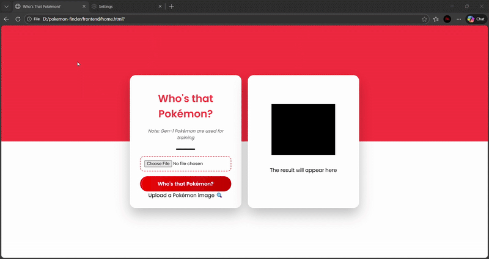

# Who's That Pokémon? 😜

A fun Pokémon image classifier inspired by the classic "Who's That Pokémon?" segment! Upload a Pokémon image and see if the model can guess which Pokémon it is. The reveal includes a dramatic silhouette, spinning card, sound effects, and text-to-speech announcement.

---

## Features

- Upload any Pokémon image and get a prediction.
- Dramatic silhouette reveal like the Pokémon show.
- Text-to-speech announcement of the predicted Pokémon name.
- Spinning card animation during the "Who's That Pokémon?" audio.
- Pokéball particle effects on reveal.
- Uses **MobileNetV2** for image classification.
- Frontend built with HTML/CSS/JS.

---

## Demo

1. Select a Pokémon image using the upload button.  
2. The card will spin and play the **"Who's That Pokémon?"** audio.  
3. After the audio finishes:
   - Pokémon silhouette turns into full-color image.
   - Pokémon name appears.
   - Text-to-speech announces the Pokémon.

---

## Output



*Nb: The GIF shows the visual reveal. The actual demo also includes the "Who's That Pokémon?" audio and text-to-speech for the Pokémon name 😜.*


## Installation

1. **Clone the repo**  

```bash
git clone https://github.com/vishak45/who-s-that-pokemon
cd who-s-that-pokemon
```
```bash
Copy code
pip install -r requirements.txt
```
Start the backend server

```bash
python server.py
```
Open frontend/home.html in a browser.

Project Structure
graphql
Copy code
```
who-s-that-pokemon/
│
├─ frontend/           # HTML, CSS, JS files for UI
│  └─ home.html
│
├─ server.py           # Flask backend to serve predictions
├─ requirements.txt    # Python dependencies
├─ .gitignore          # Ignored files (models, JSON, env, etc.)
└─ README.md           # This file
```
## Notes:
The model is trained on Gen-1 Pokémon only.

Models (.keras files) and JSON class label files are not included in the repo.

Make sure whos-that-pokemon_.mp3 audio file is in the same folder as your frontend HTML.

## License
MIT License. Use this project for fun, education, or personal projects!
